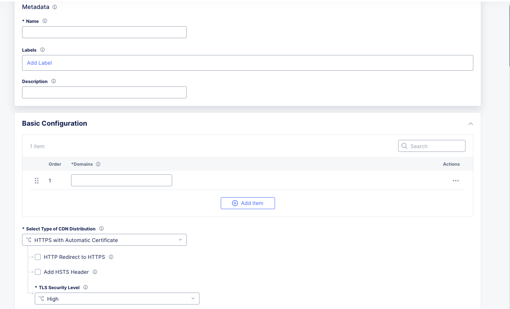
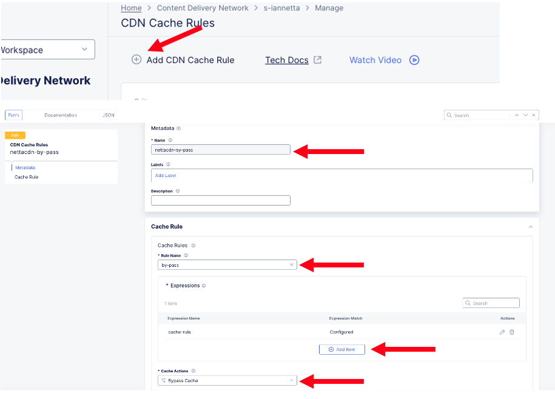
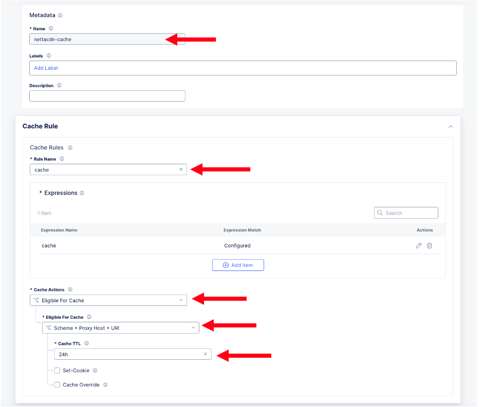
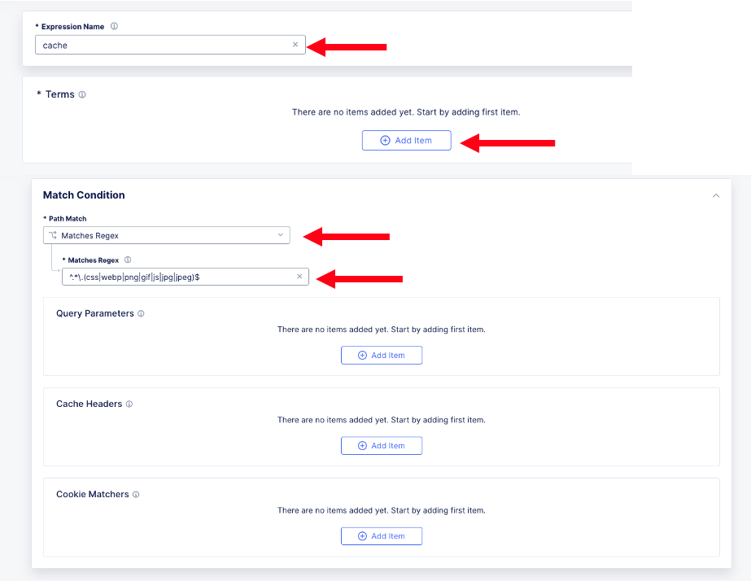
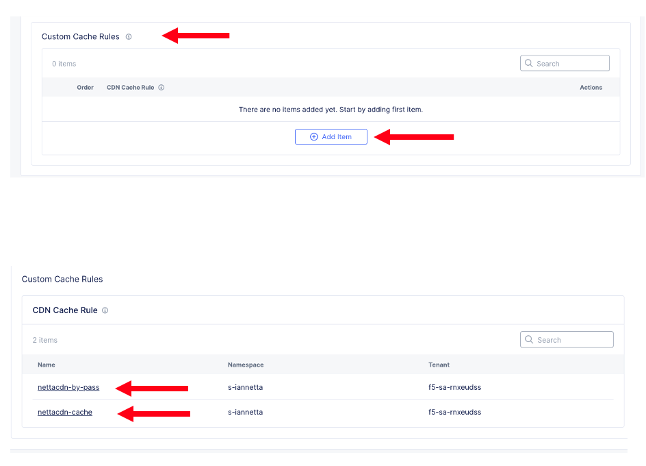
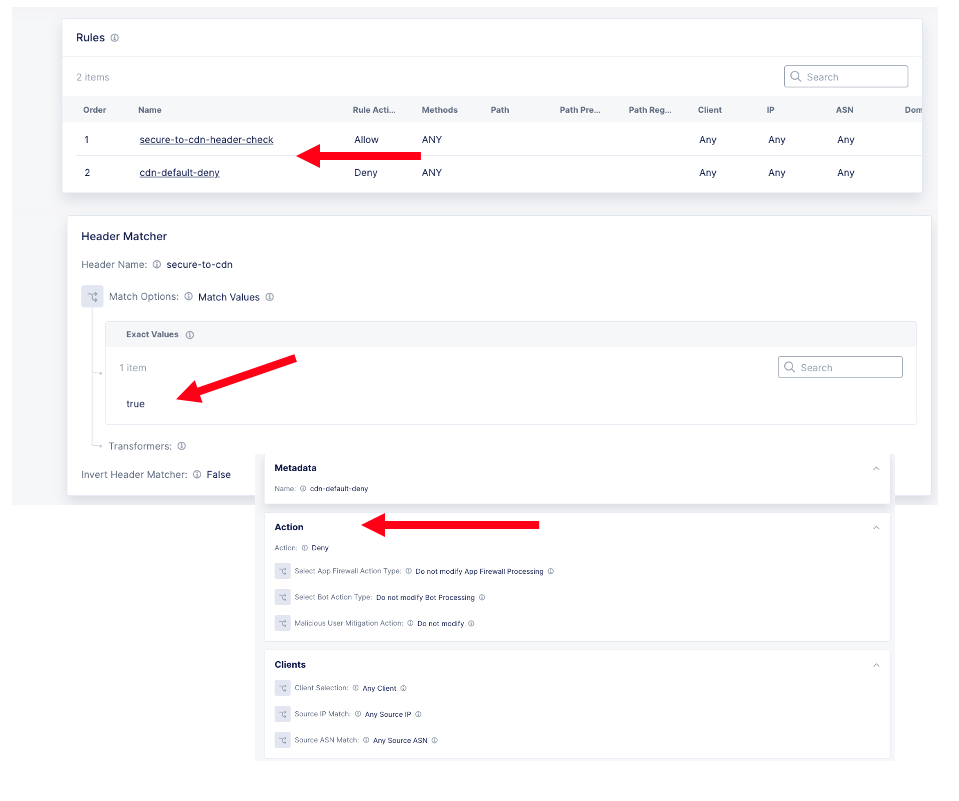

.. meta::
   :description: F5 Distributed Cloud Content Delivery via HTTP LB Layer 7 Route
   :keywords: F5, Distributed Cloud, Content Delivery Network, CDN, Static Caching
   :category: Field-Sourced-Content
   :sub-category: how-to
   :author: Steven Iannetta

.. _cdn_http_layer7_route:

Distributed Cloud Content Delivery Network (CDN) via a Layer 7 Route off of a HTTP-LB
=====================================================================================

This repo will provide a solution to introduce a process to configure a Content Delivery Networks (CDN) for static caching off of an HTTP-LB Layer 7 route
with the security enforcement point on the HTTP LB.

CDNs are essential to delivering performant web applications, especially when serving static assets, 
such as stylesheets, scripts, images, fonts, and other cacheable resources. In this article, we will explore how to deploy a CDN distribution 
behind an HTTP Load Balancer (LB) in F5 Distributed Cloud (F5 XC) and configure a regular expression (regex)-based route to direct specific 
file types—like css, js, jpg, png, and others—to the CDN for caching and accelerated delivery.

Using this architecture, your load balancer acts as the central entry point, and traffic is routed intelligently using regex rules. 
Cacheable file types are sent to the CDN distribution, while all other requests can be forwarded to other services, such as origin servers or APIs. 
This approach gives you both flexibility and control over application-level routing while adding a security control point at the HTTP-LB.

Highlevel Topology:
=========================

.. figure:: ./images/cdn-http-lb-layer7.png
   :align: center

Step-by-Step Guide
-------------------
- **Once logged into your F5 Distributed Cloud Console**
   * Goto CDN Distribution Tile
   * Click on Add Distribution

.. figure:: ./images/cdn-add-distribution.png
   :align: center

CDN Distribution
-----------------
Fill out Metadata and Basic Configuration:

#. Metadata:

   * Name
   * Labels (as needed)
   * Description

#. Basic Configuration
   
   * Domain
   * Certificate Options 

Origin Config Sub Menu: 
-------------------------------
Fill in the proper Origin Details:

#. Origin Host Header 

   * DNS Name (Host Header used to reach origin)
#. TLS Options to Servers
#. Add CDN Origin

   * This is the actual application via public DNS or IP 
#. Optional Features:

   * Origin Request Timeout
#. Apply

.. figure:: ./images/cdn-origin-config.png 
   :align: center

Caching Policy Sub Menu:
------------------------
Create any specific caching policy if no policy is created the default is to cache eligible objects for the web page based on default cache header

#. Cache TTL Mode
   
   * Can use TTL from origin, overide, or disable
#. Create a custom cache rule:

   * Bypass rule for health checking a specific path from the HTTP-LB through the CDN distribution to the origin

    * Create caching policy based on regex expression for static content
    * Add Expression Name
    * Add Terms 
    * Add Conditions

#. Attach Policy to CDN Distribution

   * Example shows adding Bypass and Cache rules:

WAF and Security Controls:
------------------
All security controls are still Private Preview with the exception of a Service Policy to limit access from HTTP LB to CDN Distribution only

#. Web Application Firewall (Preview)
#. API Protection (Preview)
#. DoS Protection (Preview)
#. Common Security - Service Policy (Preview)

   * Set a policy on CDN for Regional Edge (HTTP-LB) IPs and deny all else
   * or
   * Set a policy on CDN to only allow a request header from the HTTP LB and deny all else (example shown) we will inject the header on the HTTP LB configuration

