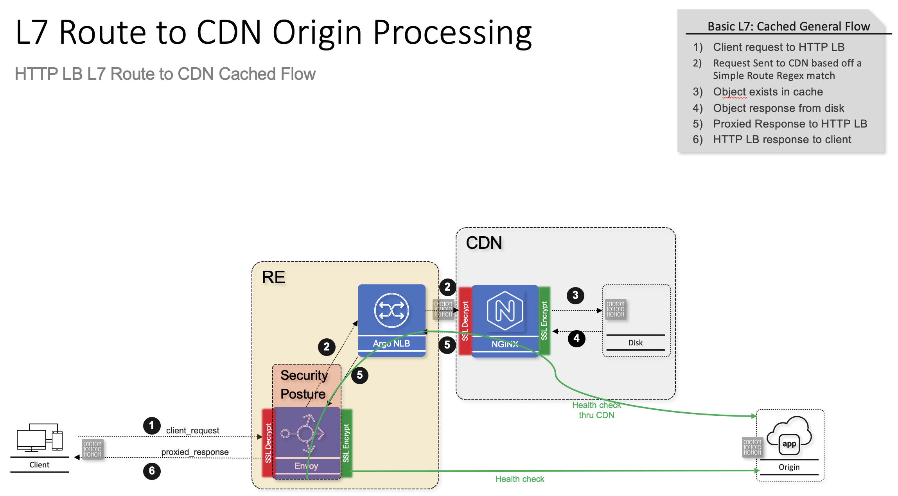
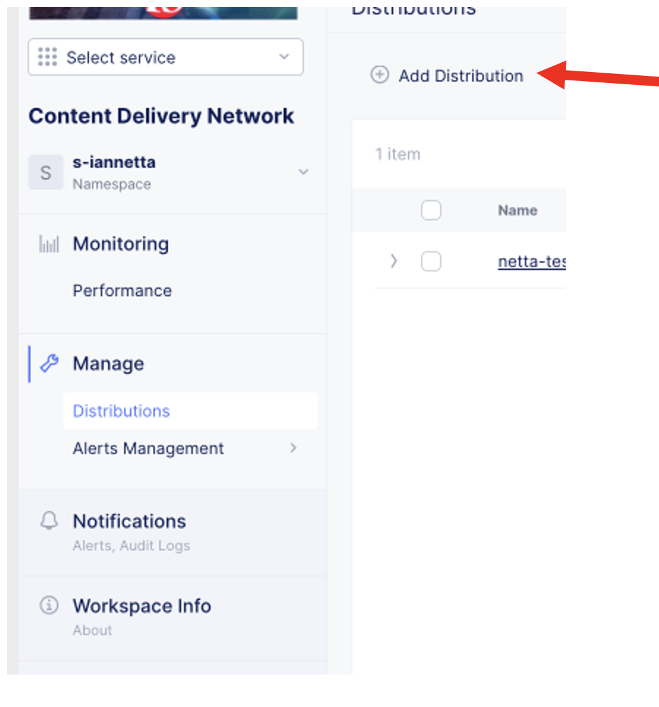
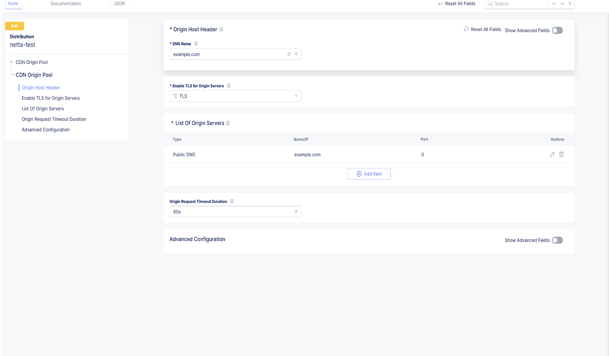

.. meta::
   :description: F5 Distributed Cloud Content Delivery via HTTP LB Layer 7 Route
   :keywords: F5, Distributed Cloud, Content Delivery Network, CDN, Static Caching
   :category: Field-Sourced-Content
   :sub-category: how-to
   :author: Steven Iannetta

.. _cdn_http_layer7_route:

Distributed Cloud Content Delivery Network (CDN) via a Layer 7 Route off of a HTTP-LB
=====================================================================================

This repo will provide a solution to introduce a process to configure a Content Delivery Networks (CDN) for static caching off of an HTTP-LB Layer 7 route
with the security enforcement point on the HTTP LB.

CDNs are essential to delivering performant web applications, especially when serving static assets, 
such as stylesheets, scripts, images, fonts, and other cacheable resources. In this article, we will explore how to deploy a CDN distribution 
behind an HTTP Load Balancer (LB) in F5 Distributed Cloud (F5 XC) and configure a regular expression (regex)-based route to direct specific 
file types—like css, js, jpg, png, and others—to the CDN for caching and accelerated delivery.

Using this architecture, your load balancer acts as the central entry point, and traffic is routed intelligently using regex rules. 
Cacheable file types are sent to the CDN distribution, while all other requests can be forwarded to other services, such as origin servers or APIs. 
This approach gives you both flexibility and control over application-level routing while adding a security control point at the HTTP-LB.

Highlevel topology below:
=========================

Step-by-Step Guide
-------------------
Once logged into your F5 Distributed Cloud Console 
   * Goto CDN Distribution Tile
   * Click on Add Distribution

   * Fill in details 
   * Name (Host Header used to reach origin)
   * DOMAIN
    * Autocert or Upload Custom Certificate
   * Add CDN Origin
    * This is the actual application via DNS or Implement

