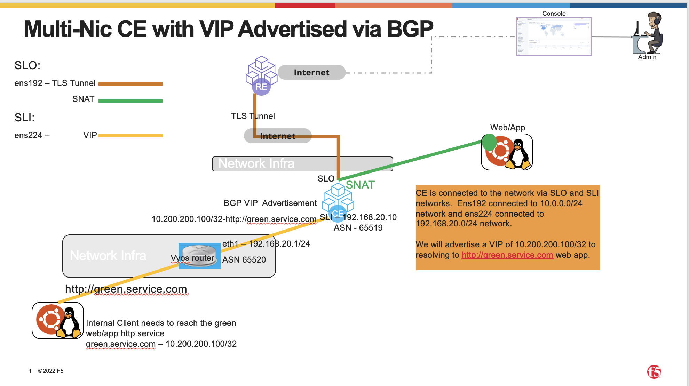

.. meta::
   :description: F5 Distributed Cloud Customer Edge Custom VIP with BGP Example
   :keywords: F5, Distributed Cloud, Customer Edge, Virtual Site, Custom VIP, BGP

.. _ce_origin_pool_virtual_site:

Distributed Cloud Customer Edge Custom VIP with BGP Advertisement Configuration
==========================================================================

This repo will provide a solution to introduce a process to configure a Custom VIP Advertisement on a Customer Edge with BGP

Prerequisite
------------------
Minimun requirements needed for this environment:
   * Distributed Cloud Site configured with the Secure Mesh Site Version 2 (SMSv2).
   * Our example we will use a vmware site (called netta-bgp) configured with SMSv2 and 2 interfaces ens192 (SLO) and ens224 (SLI)
   * We will use ens224 to establish BGP with a VYOS Router
   * Customer Edge Deployed and connected to network for L4-L7 Load Balancing.  
   * Have a connection between the network and Customer Edge that has the capability to utilize eBGP.

Highlevel topology below:

High Level Concepts
-------------------
I want to introduce a few concepts that we will be utilizing.  The first concept is what we call a Virtual Site.  

