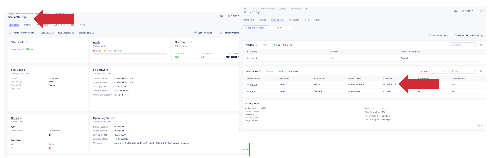
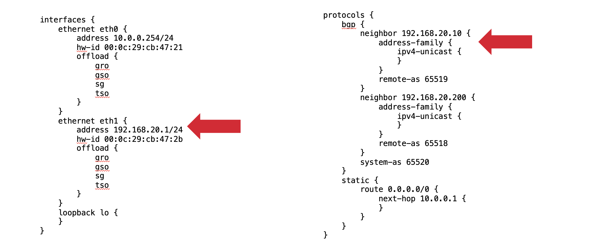
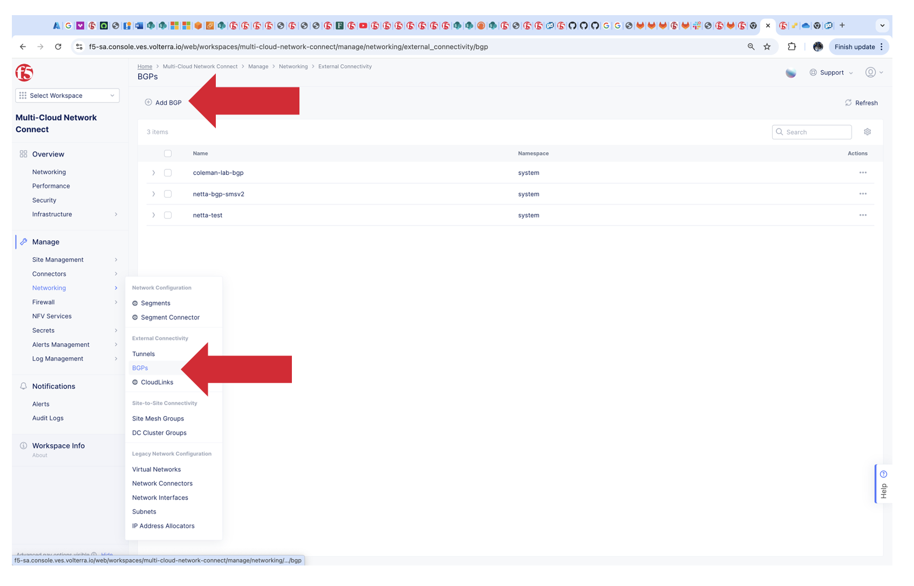

.. meta::
   :description: F5 Distributed Cloud Customer Edge Custom VIP with BGP Example
   :keywords: F5, Distributed Cloud, Customer Edge, Virtual Site, Custom VIP, BGP
   :category: Field-Sourced-Content
   :sub-category: how-to
   :author: Steven Iannetta
.. _ce_origin_pool_virtual_site:

Distributed Cloud Customer Edge Custom VIP with BGP Advertisement Configuration
==========================================================================

This repo will provide a solution to introduce a process to configure a Custom VIP Advertisement on a Customer Edge with BGP

Prerequisite
------------------
Minimun requirements needed for this environment:
   * Im using a Distributed Cloud Site configured with the Secure Mesh Site Version 2 (SMSv2).  You can use a general site or SMSv1 Legacy Site as well.
   * Our example we will use a vmware site (called netta-bgp) configured with SMSv2 and 2 interfaces ens192 (SLO) and ens224 (SLI)
   * We will use ens224 to establish BGP with a VYOS Router
   * Customer Edge Deployed and connected to network for L4-L7 Load Balancing.  
   * Have a connection between the network and Customer Edge that has the capability to utilize eBGP.
   * `F5 XC Advanced Networking BGP <https://docs.cloud.f5.com/docs-v2/multi-cloud-network-connect/how-tos/advanced-networking/bgp>`_ 

Highlevel topology below:

.. figure:: ./images/bgp_example_topology.png
   :align: center

Review
-------------------
Before we jump in if you need a refresher please see the following articles:
   * `F5 XC Advanced Networking BGP <https://docs.cloud.f5.com/docs-v2/multi-cloud-network-connect/how-tos/advanced-networking/bgp>`_ 
   * `F5 XC Reference Architecture <https://community.f5.com/kb/technicalarticles/f5-distributed-cloud-customer-edge-on-f5-rseries-%E2%80%93-reference-architecture/333034>`_
   * `F5 XC Routing Options <https://community.f5.com/kb/technicalarticles/f5-distributed-cloud---customer-edge-site---deployment--routing-options/319435>`_

BGP Configuration
-------------------
As stated and shown above in the prerequisite and topology sections we have the following setup:
   * Distributed Cloud Site configured with the Secure Mesh Site Version 2 (SMSv2).
   * Our example we will use a vmware site (called netta-bgp) configured with SMSv2 and 2 interfaces ens192 (SLO) and ens224 (SLI)
   * We will use ens224 to establish BGP with a VYOS Router

Vyos Config:
   * VYOS Router configured to establish BGP on ethernet 1 interface peering to IP 192.168.20.10 and remote ASN 65519 with local ASN of 65520.  
   * In my config example I have 2 peers in the configuration we will only focus on the one

Distributed CLoud CE Config:
   * Goto Multi-Cloud Network Connect
    * Networking
        * BGPs
            * Add BGP

